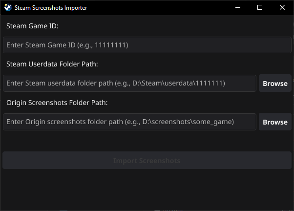

# Steam Screenshots Importer

This little program allows you to transfer your screenshots from games that were taken **outside** of the Steam platform into a format that Steam will understand, to further share them in the community and beyond.



For example, you made a screenshot with Nvidia, AMD or **other application**, because you played through XBOX game pass, and now you want to share these screenshots in Steam, you just need to run this program, specify the **game ID** (you can find it at https://steamdb.info/), the path to the **Steam user folder** and the path to the **folder where your screenshots are** and everything, the program will do everything automatically! You just need to **restart Steam**, because it may not display the added screenshots.

(screenshots in origin folder must be `.jpg`, `.jpeg` or `.png`)

# Installation
1. Download `.exe` file from latest release: [releases](https://github.com/Keonik1/Steam-Screenshots-Importer/releases)
2. Run `.exe` file.

# Build from source
1. Install Go: https://go.dev/doc/install
2. Install fyne.io: https://docs.fyne.io/started/
3. Open powershell and build application (first build can take over 5 minutes)
```powershell
go install fyne.io/fyne/v2/cmd/fyne@latest
fyne package -os windows -icon .\Icon.png
```

# Limitations
- Currently available for windows only, compatibility with linux and macos has not been tested, but you can check it yourself and send Pull Request with improvements!
